# YaraConnect Platform - Big Picture Architecture

## System Overview

YaraConnect is a comprehensive digital agricultural platform serving farmers, retailers, dealers, and administrators across multiple countries (India, Kenya, Tanzania, Indonesia, Thailand, Vietnam, Philippines, Ghana, Uganda, Malaysia).

---

## High-Level Architecture

```mermaid
flowchart TB
    subgraph Clients["🖥️ CLIENT APPLICATIONS"]
        direction LR
        FC["📱 FarmCare Mobile<br/><i>React Native</i>"]
        YC["📱 YaraConnect Mobile<br/><i>React Native</i>"]
        BW["🌐 Bodega Web<br/><i>Next.js</i>"]
        AU["🖥️ Admin UI<br/><i>React + Vite</i>"]
    end

    subgraph Backend["⚙️ BACKEND SERVICES"]
        direction TB
        BFF["🔀 Admin BFF<br/><i>NestJS - Port 3000</i>"]

        subgraph Core["Core Services"]
            direction LR
            LS["💎 Loyalty Service<br/><i>Express - Port 8090</i>"]
            MS["🛒 Marketplace Service<br/><i>Express - Port 3000</i>"]
            RE["📐 Rule Engine<br/><i>NestJS - Port 3005</i>"]
        end

        IS["🔗 Intermediate Service<br/><i>Express - Port 9002</i>"]
    end

    subgraph Data["💾 DATA LAYER"]
        direction LR
        PG[(PostgreSQL)]
        MG[(MongoDB)]
        RD[(Redis)]
        OS[(OpenSearch)]
    end

    subgraph MQ["📨 MESSAGE QUEUES"]
        direction LR
        KF[Apache Kafka]
        SQS[AWS SQS]
        BQ[BullMQ]
        TM[Temporal.io]
    end

    FC --> BFF
    FC --> LS
    YC --> BFF
    YC --> LS
    YC --> MS
    BW --> MS
    BW --> RE
    BW --> LS
    AU --> BFF

    BFF --> LS
    BFF --> MS
    BFF --> RE
    BFF --> IS

    LS --> IS
    LS --> MS
    MS --> RE
    MS --> IS
    RE --> IS

    LS --> PG
    MS --> PG
    BFF --> PG
    IS --> PG
    RE --> MG

    LS --> RD
    MS --> RD
    IS --> RD

    MS --> OS

    LS --> KF
    MS --> KF
    IS --> KF
    BFF --> KF

    LS --> SQS
    MS --> SQS
    RE --> SQS

    LS --> BQ
    MS --> BQ
    IS --> BQ

    LS --> TM
    MS --> TM

    style Clients fill:#e1f5fe,stroke:#01579b
    style Backend fill:#fff3e0,stroke:#e65100
    style Data fill:#e8f5e9,stroke:#2e7d32
    style MQ fill:#fce4ec,stroke:#c2185b
```

---

## Service Communication Flow

```mermaid
flowchart LR
    subgraph Mobile["📱 Mobile Apps"]
        FC["FarmCare"]
        YC["YaraConnect"]
    end

    subgraph Web["🌐 Web Apps"]
        BW["Bodega Web"]
        Admin["Admin Dashboard"]
    end

    subgraph Gateway["🚪 API Gateway"]
        BFF["Admin BFF"]
    end

    subgraph Services["⚙️ Microservices"]
        LS["Loyalty<br/>Service"]
        MS["Marketplace<br/>Service"]
        RE["Rule Engine<br/>Service"]
        IS["Intermediate<br/>Service"]
    end

    subgraph External["🌍 External"]
        CAP["Capillary<br/>(Loyalty)"]
        PERX["Perx<br/>(Rewards)"]
    end

    FC -->|"REST API"| LS
    FC -->|"REST API"| MS
    YC -->|"REST API"| LS
    YC -->|"REST API"| MS
    BW -->|"REST API"| MS
    BW -->|"REST API"| RE
    BW -->|"REST API"| LS
    BW -->|"Rewards"| PERX
    Admin -->|"REST API"| BFF

    BFF -->|"Internal API"| LS
    BFF -->|"Internal API"| MS
    BFF -->|"Internal API"| RE
    BFF -->|"Internal API"| IS

    LS <-->|"Sync"| MS
    MS -->|"Discount Check"| RE
    LS -->|"Points/Rewards"| IS
    MS -->|"Transactions"| IS

    IS -->|"Loyalty API"| CAP

    style Mobile fill:#bbdefb,stroke:#1976d2
    style Web fill:#c8e6c9,stroke:#388e3c
    style Gateway fill:#fff9c4,stroke:#fbc02d
    style Services fill:#ffccbc,stroke:#e64a19
    style External fill:#e1bee7,stroke:#7b1fa2
```

---

## Third-Party Services Integration

---

## Service Dependencies

```mermaid
graph TD
    subgraph Mobile["📱 Mobile Applications"]
        FCM["FarmCare Mobile"]
        YCM["YaraConnect Mobile"]
    end

    subgraph Web["🌐 Web Applications"]
        BWB["Bodega Web"]
        AUI["Admin UI"]
    end

    subgraph BFF["🔀 BFF Layer"]
        ABFF["Admin BFF"]
    end

    subgraph Core["⚙️ Core Services"]
        LS["Loyalty Service"]
        MS["Marketplace Service"]
        RE["Rule Engine"]
        IS["Intermediate Service"]
    end

    subgraph External["🌍 External Services"]
        CAP["Capillary"]
        PERX["Perx"]
        ZEN["Zendesk"]
        PAY["Payment Service"]
    end

    FCM --> LS
    FCM --> PERX
    FCM -.->|"Bodega API"| MS

    YCM --> LS
    YCM --> MS
    YCM --> ABFF

    BWB --> MS
    BWB --> RE
    BWB --> LS
    BWB --> PERX
    AUI --> ABFF

    ABFF --> LS
    ABFF --> MS
    ABFF --> RE
    ABFF --> IS

    LS --> IS
    LS --> MS
    LS --> ZEN
    LS --> PAY

    MS --> RE
    MS --> IS
    MS --> LS
    MS --> PAY
    MS --> ZEN

    IS --> CAP

    RE -.->|"Product Data"| MS

    style Mobile fill:#e3f2fd,stroke:#1976d2
    style Web fill:#e8f5e9,stroke:#388e3c
    style BFF fill:#fff8e1,stroke:#ff8f00
    style Core fill:#fce4ec,stroke:#c2185b
    style External fill:#f3e5f5,stroke:#7b1fa2
```

---

## Data Flow Architecture

```mermaid
sequenceDiagram
    participant U as 👤 User
    participant M as 📱 Mobile App
    participant B as 🔀 BFF
    participant L as 💎 Loyalty
    participant K as 📨 Kafka
    participant I as 🔗 Intermediate
    participant C as 🏢 Capillary
    participant D as 💾 Database

    U->>M: Scan QR / Make Purchase
    M->>B: POST /transaction
    B->>L: Forward Request
    L->>D: Store Transaction
    L->>K: Publish Event
    K->>I: Consume Event
    I->>C: Sync Points
    C-->>I: Confirm
    I-->>K: Ack
    L-->>B: Response
    B-->>M: Success
    M-->>U: Show Points Earned
```

---

## Deployment Architecture

```mermaid
flowchart TB
    subgraph Users["👥 USERS"]
        F["🧑‍🌾 Farmers"]
        R["🏪 Retailers"]
        D["📦 Dealers"]
        A["👨‍💼 Admins"]
    end

    subgraph CDN["🌐 CDN / EDGE"]
        CF["CloudFront / CDN"]
    end

    subgraph LB["⚖️ LOAD BALANCER"]
        ALB["Application<br/>Load Balancer"]
    end

    subgraph Apps["📱 APP STORES"]
        AS["Apple App Store"]
        GP["Google Play Store"]
    end

    subgraph K8s["☸️ KUBERNETES CLUSTER"]
        subgraph NS1["Namespace: Frontend"]
            AdminPod["Admin UI<br/>Pods"]
            BodegaPod["Bodega Web<br/>Pods"]
        end

        subgraph NS2["Namespace: Backend"]
            BFFPod["BFF Pods"]
            LSPod["Loyalty Pods"]
            MSPod["Marketplace Pods"]
            REPod["Rule Engine Pods"]
            ISPod["Intermediate Pods"]
        end
    end

    subgraph DB["💾 MANAGED DATABASES"]
        RDS["Amazon RDS<br/>PostgreSQL"]
        DOC["DocumentDB<br/>MongoDB"]
        EC["ElastiCache<br/>Redis"]
        OSS["OpenSearch<br/>Service"]
    end

    subgraph MQ["📨 MESSAGING"]
        MSK["Amazon MSK<br/>Kafka"]
        SQSM["Amazon SQS"]
    end

    subgraph Storage["📁 STORAGE"]
        S3B["S3 Buckets"]
    end

    F --> Apps
    R --> Apps
    D --> Apps
    A --> CF

    Apps --> ALB
    CF --> ALB

    ALB --> AdminPod
    ALB --> BodegaPod
    ALB --> BFFPod

    BodegaPod --> MSPod
    BodegaPod --> REPod
    BodegaPod --> LSPod

    BFFPod --> LSPod
    BFFPod --> MSPod
    BFFPod --> REPod
    BFFPod --> ISPod

    LSPod --> RDS
    MSPod --> RDS
    BFFPod --> RDS
    ISPod --> RDS
    REPod --> DOC

    LSPod --> EC
    MSPod --> EC
    ISPod --> EC

    MSPod --> OSS

    LSPod --> MSK
    MSPod --> MSK
    ISPod --> MSK

    LSPod --> SQSM
    MSPod --> SQSM
    REPod --> SQSM

    LSPod --> S3B
    MSPod --> S3B
    ISPod --> S3B

    style Users fill:#e8eaf6,stroke:#3f51b5
    style CDN fill:#e0f7fa,stroke:#00acc1
    style LB fill:#fff3e0,stroke:#ff9800
    style Apps fill:#f3e5f5,stroke:#9c27b0
    style K8s fill:#e8f5e9,stroke:#4caf50
    style DB fill:#fce4ec,stroke:#e91e63
    style MQ fill:#fff8e1,stroke:#ffc107
    style Storage fill:#efebe9,stroke:#795548
```

---

## Service Relationships Matrix

| Service | Depends On | Consumed By |
|---------|------------|-------------|
| **sh-farmcare-mobile** | Bodega API, Loyalty Service, Perx, SkyWeather | - |
| **sh-yara-connect-mobile** | Loyalty Service, Marketplace Service, Admin BFF | - |
| **yc-bodega-web** | Marketplace Service, Rule Engine, Loyalty Service, Perx, Auth0 | - |
| **sh-yaraconnect-admin-ui** | Admin BFF | - |
| **sh-yaraconnect-admin-bff** | Loyalty, Product, Intermediate, Reporting, Discount | Admin UI, Mobile Apps |
| **sh-yc-loyalty-service** | Intermediate, Marketplace, Capillary, Payment, Zendesk | BFF, Mobile Apps, Bodega Web |
| **sh-yc-marketplace-service** | Loyalty, Rule Engine, Payment, Product Catalog | BFF, Mobile Apps, Bodega Web |
| **sh-yc-intermediate-service** | Capillary, Product Catalog, Benefit One | Loyalty, Marketplace |
| **yc-rule-engine-service** | Product Catalog Service | Marketplace, BFF, Bodega Web |

---

## Technology Stack

---

## Port Allocation

| Service | Port | Protocol |
|---------|------|----------|
| yc-bodega-web | 3000 | HTTP |
| sh-yaraconnect-admin-bff | 3000 | HTTP |
| sh-yc-marketplace-service | 3000 | HTTP |
| yc-rule-engine-service | 3005 | HTTP |
| sh-yc-loyalty-service | 8090 | HTTP |
| sh-yc-intermediate-service | 9002 | HTTP |

---

## Multi-Country Support

```mermaid
graph LR
    subgraph Asia["🌏 ASIA"]
        IN["🇮🇳 India"]
        ID["🇮🇩 Indonesia"]
        TH["🇹🇭 Thailand"]
        VN["🇻🇳 Vietnam"]
        MY["🇲🇾 Malaysia"]
        PH["🇵🇭 Philippines"]
    end

    subgraph Africa["🌍 AFRICA"]
        KE["🇰🇪 Kenya"]
        TZ["🇹🇿 Tanzania"]
        GH["🇬🇭 Ghana"]
        UG["🇺🇬 Uganda"]
    end

    Platform["🏢 YaraConnect<br/>Platform"]

    Platform --> Asia
    Platform --> Africa

    style Asia fill:#ffecb3,stroke:#ff8f00
    style Africa fill:#c8e6c9,stroke:#43a047
    style Platform fill:#1565c0,stroke:#0d47a1,color:#fff
```

Each country has:
- **Tenant-specific Auth0 configuration**
- **Localized content and languages**
- **Country-specific business rules**
- **Regional API endpoints**
- **Local payment integrations**
- **Compliance with local regulations**

---

## API Endpoint Summary

---

## Event-Driven Architecture

```mermaid
flowchart LR
    subgraph Producers["📤 Event Producers"]
        LS["Loyalty Service"]
        MS["Marketplace Service"]
        BFF["Admin BFF"]
    end

    subgraph Kafka["📨 Apache Kafka"]
        T1["orders-topic"]
        T2["inventory-topic"]
        T3["points-topic"]
        T4["notifications-topic"]
    end

    subgraph Consumers["📥 Event Consumers"]
        IS["Intermediate Service"]
        NS["Notification Service"]
        RS["Reporting Service"]
    end

    LS -->|"Points Events"| T3
    MS -->|"Order Events"| T1
    MS -->|"Inventory Events"| T2
    BFF -->|"Admin Events"| T4

    T1 --> IS
    T2 --> IS
    T3 --> IS
    T3 --> NS
    T4 --> NS
    T1 --> RS
    T3 --> RS

    style Producers fill:#e3f2fd,stroke:#1976d2
    style Kafka fill:#fff3e0,stroke:#f57c00
    style Consumers fill:#e8f5e9,stroke:#388e3c
```

---

## Security Architecture

